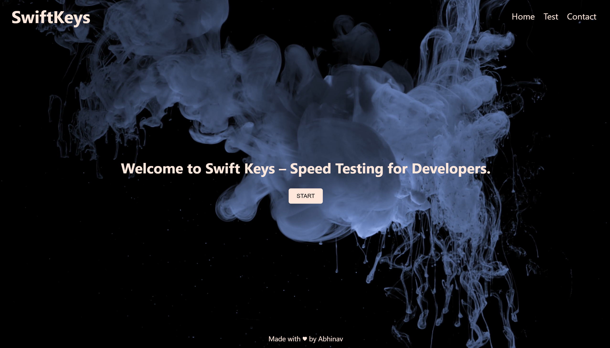

# ⌨️ SwiftKeys: Speed Testing for Developers

[](https://bombaleabhinav.github.io/SwiftKeys/)
[](https://opensource.org/licenses/MIT)

**SwiftKeys** is a high-performance, immersive web application designed to help developers and enthusiasts master their typing speed. Unlike traditional typing tests, SwiftKeys focuses on real-world workflows, including terminal commands, Git operations, and programming logic.



---

## 🚀 Key Features

### 🛠️ Developer-Centric Modes
*   **Basics & Endurance**: Long-form text designed to build flow and muscle memory.
*   **Git Master**: Practice essential Git commands like `push`, `pull`, `branch`, and `merge`.
*   **Terminal Pro**: Master bash/shell commands (`ls`, `mkdir`, `pwd`) to increase CLI efficiency.
*   **Logic Challenges**: Solve real-world scenarios by typing out command sequences for common tasks.

### ✨ Immersive UX/UI
*   **Dynamic Particle Engine**: Satisfying visual feedback with custom golden particles for correct hits and red alerts for mistakes.
*   **Atmospheric Audio**: Enjoy a calming ambient piano background that reacts to your typing rhythm, with distinct sound cues for errors.
*   **Cinematic Backgrounds**: High-quality video backgrounds that create a focused, high-tech environment.
*   **Real-time Analytics**: Instant feedback on **WPM (Words Per Minute)** and **Accuracy** percentage.

### 📱 Responsive Design
*   Fully optimized for desktop and mobile browsers.
*   Sleek Dark Mode aesthetic using a premium color palette.

---

## 🎨 Design System

SwiftKeys uses a curated color palette designed for high contrast and modern aesthetics:

| Color | Hex | Purpose |
| :--- | :--- | :--- |
| **Deep Space** | `#000000` | Primary Background |
| **Peach White** | `#FFE8DB` | Primary Text |
| **Ocean Blue** | `#5682B1` | Focus & Accents |
| **Golden Yellow**| `#EFBF04` | Success & Correct Keys |

---

## 🛠️ Tech Stack

- **Frontend**: HTML5, Vanilla CSS3 (Custom properties, Flexbox/Grid)
- **Logic**: Vanilla JavaScript (ES6+)
- **Assets**: 
  - Particle Engine: Custom JS implementation
  - Audio: HTML5 Audio API
  - Icons: FontAwesome
- **Analytics**: Google Tag Manager (gtag.js)

---

## 📂 Project Structure

```text
├── index.html              # Landing Page
├── normal-typing.html      # Main Typing Test Engine
├── git-commands.html       # Git Practice Mode
├── python-commands.html    # Python Practice Mode
├── contact.html            # Contact Page
├── style/
│   └── style.css           # Global stylesheet
├── media/                  # Video BGs, Audio, and Images
└── readme.md               # You are here!
```

---

## 🏁 Getting Started

To run SwiftKeys locally:

1.  **Clone the repository**:
    ```bash
    git clone https://github.com/bombaleabhinav/SwiftKeys.git
    ```
2.  **Open in Browser**:
    Simply open `index.html` in any modern web browser.

---

## 🤝 Contributing

Contributions are welcome! Whether it's adding new command categories, improving the particle engine, or tweaking the UI:

1.  Fork the Project
2.  Create your Feature Branch (`git checkout -b feature/AmazingFeature`)
3.  Commit your Changes (`git commit -m 'Add some AmazingFeature'`)
4.  Push to the Branch (`git push origin feature/AmazingFeature`)
5.  Open a Pull Request

---

## 👤 Author

**Abhinav**
- GitHub: [@bombaleabhinav](https://github.com/bombaleabhinav)

---

> "Slow is smooth, smooth is fast." - Master your keys with SwiftKeys.
